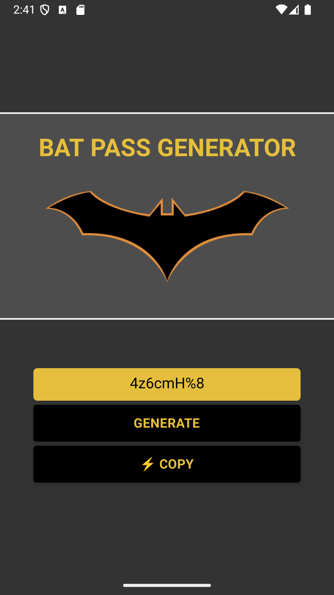

# Batman Password Generator

Um aplicativo mobile desenvolvido em **React Native** com **TypeScript**, que gera senhas aleatórias com a temática do Batman.
Inclui botões para **gerar senhas** e **copiar para a área de transferência**.

---

## Tecnologias

* ⚛️ [React Native](https://reactnative.dev/)
* 📘 [TypeScript](https://www.typescriptlang.org/)
* 🦇 Estilo inspirado no universo do Batman

---

## Funcionalidades

* 🔑 Geração de senhas aleatórias seguras
* 📋 Botão para copiar a senha gerada
* 🎲 Botão para gerar uma nova senha
* 🦇 Interface temática inspirada no Batman

---

## Como rodar o projeto

```bash
# Clone o repositório
git clone "link"
```
```bash
# Acesse a pasta do projeto
cd Bat-pass-app
```
```bash
# Instale as dependências
npm install
# ou
yarn install
```
```bash
# Execute no Android
npx react-native run-android
```
---

## 📸 Screenshots




