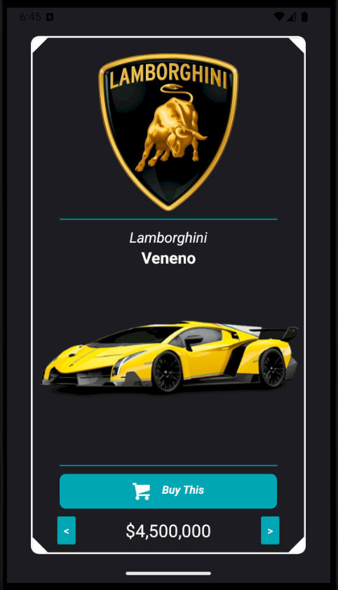

# 🚗 Lamborghini Garage

<p align="justify"> Um aplicativo mobile desenvolvido com **React Native + TypeScript** que simula uma vitrine exclusiva de carros da **Lamborghini**.
O usuário pode visualizar os modelos, seus preços e informações, navegando entre os veículos disponíveis e simulando a compra.</p>

---

## 📱 Funcionalidades

* Exibição do **logo oficial da Lamborghini** e do modelo do carro.
* Card interativo com imagem e nome do veículo.
* Botão de compra estilizado.
* Preço destacado de cada carro.
* Navegação entre os modelos com setas de **próximo/anterior**.
* Interface no estilo **dark mode**, moderna e minimalista.

---

## 🛠️ Tecnologias Utilizadas

* **React Native**
* **Expo**
* **TypeScript**
* **Componentes customizados** (CardView, BuyButton, Divider)

---

## 📸 Demonstração

<div align="center" >
    
</div>

---

## 🚀 Como rodar o projeto

1. Clone o repositório:

```bash
git clone https://github.com/seu-usuario/lamborghini-garage.git
```

2. Instale as dependências:

```bash
npm install
```

3. Execute o app:

```bash
npm start
```

4. Escaneie o QR Code com o aplicativo **Expo Go** no celular.

---

## 🏎️ Sobre

<p align="justify"> Este projeto foi criado como prática de **React Native** e **TypeScript**, explorando componentes reutilizáveis, estilização e organização de código.</p>

